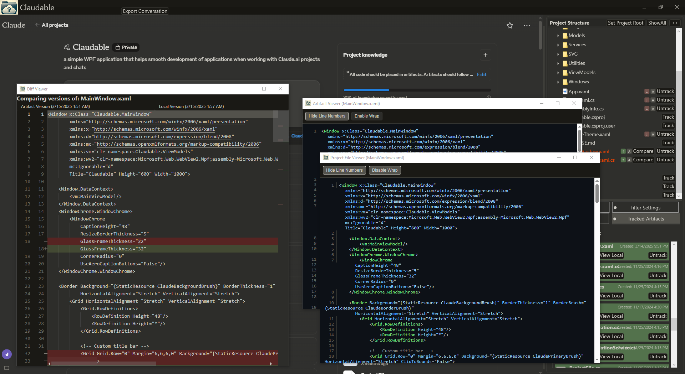

# Claudable

Claudable is a desktop application designed to enhance the Claude AI experience by providing local file management and integration capabilities. This application serves as a bridge between Claude AI's web interface and your local file system, offering a seamless workflow for managing projects, artifacts, and downloads.

## No association with Anthropic or Claude.ai
This project is developed independently and has no official association with Claude.ai or Anthropic.

## A Note about Embedded Web Browser Security
Claudable, like other applications with embedded browsers, has full access to web content within its browser component. This includes the ability to execute JavaScript and interact with logged-in sessions. 

While Claudable doesn't request or store Claude AI credentials directly, the embedded browser has the same access as a regular browser when you're logged in. This level of access is standard for embedded browser applications and extensions.

Users should exercise caution and only use embedded browser applications from trusted sources, especially when they access external web content. 

The source code of Claudable is open and concise, allowing for easy review. If concerned about security implications, users can analyze the entire codebase, including uploading it to a Claude AI project for evaluation.

## Key Features

### 1. Web Integration
- Seamlessly embeds Claude AI's web interface
- Full support for all Claude AI features
- Side-by-side view with local file management

### 2. Project Structure Management
- Advanced tree view of local project files
- Real-time file system monitoring
- Context menu integration with Windows Explorer
- Drag-and-drop support
- Custom file filtering system with default filters for:
  - Hidden folders (starting with a dot)
  - Common dependency folders (node_modules)

### 3. Artifact Synchronization
- Track local files as Claude artifacts
- Automatic version comparison
- Visual indicators for sync status:
  - "A" badge for tracked artifacts
  - "↑" for local files newer than artifacts
  - "↓" for artifacts newer than local files
- One-click synchronization of outdated files
- Batch synchronization at folder level
- Content comparison with diff viewer

### 4. SVG Support
- Export as PNG or ICO formats
- Drag-and-drop SVG conversion

### 5. Download Management
- Integrated download tracking
- Progress monitoring
- Drag-and-drop file organization
- Status notifications

### 6. Project Association
- Automatic linking of local folders with Claude projects
- State persistence between sessions
- Multi-project support
- Automatic project switching

### 7. Layout Customization
- Swappable panels
- Adjustable split view
- State persistence
- Custom Claude-inspired theme

### 8. Filtering System
- Multiple view modes:
  - Show all files
  - Show only tracked artifacts
  - Show only outdated files
- Custom file/folder exclusion rules
- Real-time filter updates

### 9. File Analysis
- Built-in diff viewer with syntax highlighting
- Artifact viewer with language detection
- File modification tracking
- Content comparison tools
- Side-by-side diff view

### 10. Conversation Export
- Export conversations to text files
- Preserve conversation structure
- Include thinking summaries when available

## Technical Stack
- **Framework**: WPF (Windows Presentation Foundation)
- **Runtime**: .NET (Targeting the latest version)
- **Browser Component**: WebView2
- **Key Libraries**:
  - SkiaSharp for graphics processing
  - SVG.Skia for SVG handling
  - Newtonsoft.Json for serialization
  - Win32 API integration for shell features
  - Monaco Editor for diff viewing
  - Highlight.js for syntax highlighting
  - Markdown-it for Markdown rendering
  - Mermaid for diagram rendering

## Getting Started

### Prerequisites
- Windows 10 or later
- Visual Studio 2022 or later
- .NET 8.0 SDK
- WebView2 Runtime (automatically installed with modern Windows)

### Installation
1. Clone or download the repository
2. Open in Visual Studio
3. Build and Run

### First Run Setup
1. Launch Claudable and wait for the Claude AI interface to load
2. Log in to your Claude AI account
3. Navigate to your Claude AI project
4. Click "Set Project Root" to select your local project folder
5. The project structure will appear in the right panel

## Usage Guide

### Basic Navigation
- Left panel: Claude AI interface (by default)
- Right panel: Project management (by default)
- Drag the splitter to adjust panel sizes
- Use the swap button (↔) to switch panel positions

### Managing Files
1. **Tracking Files**
   - Click "Track" on any file to create a Claude artifact
   - The file will show an "A" badge when tracked
   - Sync status indicators show version differences

2. **Syncing Content**
   - Click "Compare" to view differences
   - Use folder-level sync button to update multiple files
   - Drag files from Explorer to add to project

3. **SVG Handling**
   - Drag SVG artifacts to project folders
   - Hold Ctrl while dragging for ICO format
   - Regular drag creates PNG format

4. **Downloads**
   - Downloads appear in the Downloads tab
   - Drag downloaded files to project folders
   - Progress and status are shown live

### View Modes
- Use the filter mode button to cycle through:
  1. Show All Files
  2. Show Only Tracked Artifacts
  3. Show Only Outdated Files

### Custom Filters
1. Go to Filter Settings tab
2. Enter file/folder patterns to exclude
3. Default filters are applied automatically:
   - All folders starting with a dot (like .git, .vs, etc.)
   - The node_modules folder
4. Filters apply across all view modes
5. Settings persist between sessions

### Working with Artifacts
- Double-click files to view content
- Use Compare button for diff view
- Right-click for Windows context menu

### Exporting Conversations
- Use the "Export Conversation" button in the top bar
- Save conversations as text files for later reference
- All conversation content is preserved, including thinking steps

## Contributing
Contributions are welcome! Please feel free to submit pull requests.

## License
This project is licensed under the MIT License - see the LICENSE file for details.

## Acknowledgements
- Claude AI by Anthropic
- Microsoft for WebView2, WPF, and Monaco Editor
- SkiaSharp and SVG.Skia libraries
- Highlight.js for syntax highlighting
- Monaco Editor for diff viewing
- Markdown-it for Markdown rendering
- Mermaid for diagram support